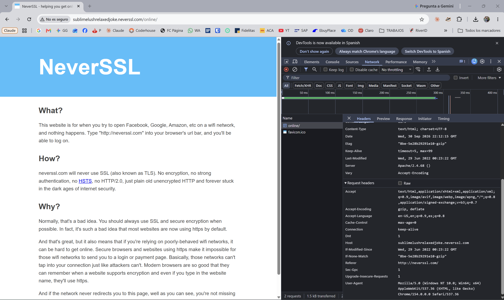

# 🔓 Informe de Auditoría de Red Wi-Fi Insegura

**Práctica:** `practica-wifi-segura`
**Autor:** Juan Pablo
**Rol:** Auditor de seguridad junior
**Fecha:** 30/09/2026

---

## 1. Introducción

Cuando nos conectamos a una Wi-Fi pública (cafetería, aeropuerto, hotel), compartimos el mismo "aire" con decenas de desconocidos. Todo lo que nuestro dispositivo envía al router viaja por ondas de radio que cualquier persona cercana puede captar.

El objetivo de esta auditoría es **demostrar en la práctica qué información queda expuesta cuando navegamos por HTTP** (sin cifrado), qué riesgos implica hacerlo en una red pública y **cómo una VPN protege ese tráfico**.

**Herramientas utilizadas:**

- Google Chrome – Herramientas de desarrollador (F12) → pestaña **Network (Red)**
- Sitio de prueba sin cifrado: `http://neverssl.com`

---

## 2. Sitio analizado

| Campo | Valor |
|---|---|
| **Sitio** | `http://neverssl.com` (redirige a `http://sublimelushrelaxedjoke.neverssl.com/online/`) |
| **Host** | `sublimelushrelaxedjoke.neverssl.com` (subdominio aleatorio de `neverssl.com`) |
| **Protocolo** | **HTTP** (sin cifrado, puerto 80) |
| **Propósito del sitio** | Página creada a propósito para no usar nunca HTTPS; sirve para pruebas y laboratorios |

### ¿Qué protocolo utiliza el sitio?

El sitio utiliza **HTTP**, no HTTPS. Se comprueba de tres formas:

1. La URL empieza con `http://` y no con `https://`.
2. Chrome muestra el aviso **"No seguro"** a la izquierda de la barra de direcciones.
3. En la pestaña Network, la solicitud va al **puerto 80** (HTTP) y no al 443 (HTTPS).

Esto significa que **toda la comunicación viaja en texto plano**. Es como una postal escrita a mano: cualquiera que la tenga en las manos puede leerla.

---

## 3. Evidencia observada

**Procedimiento:**

1. Ingresé a `http://neverssl.com`.
2. Abrí las herramientas de desarrollador con **F12**.
3. Seleccioné la pestaña **Network (Red)**.
4. Recargué la página (**F5**).
5. Seleccioné la **primera solicitud** (el documento `online/`).

> **Nota:** `neverssl.com` redirige a un subdominio aleatorio (en mi caso `sublimelushrelaxedjoke.neverssl.com/online/`) para evitar que el navegador use una versión guardada en caché. El sitio sigue siendo el mismo y sigue funcionando por HTTP.



### Datos de la solicitud

| Dato | Valor observado |
|---|---|
| **URL solicitada** | `http://sublimelushrelaxedjoke.neverssl.com/online/` |
| **Método HTTP** | `GET` |
| **Código de estado** | `200 OK` |
| **Host** | `sublimelushrelaxedjoke.neverssl.com` |
| **Protocolo** | `http/1.1` |
| **Puerto remoto** | `80` |
| **Servidor** | `Apache/2.4.68` |
| **Tipo de contenido** | `text/html; charset=UTF-8` |

### Headers de la solicitud (Request Headers)

```http
GET /online/ HTTP/1.1
Host: sublimelushrelaxedjoke.neverssl.com
Connection: keep-alive
Cache-Control: max-age=0
Upgrade-Insecure-Requests: 1
User-Agent: Mozilla/5.0 (Windows NT 10.0; Win64; x64) AppleWebKit/537.36 (KHTML, like Gecko) Chrome/154.0.0.0 Safari/537.36
Accept: text/html,application/xhtml+xml,application/xml;q=0.9,image/avif,image/webp,image/apng,*/*;q=0.8,application/signed-exchange;v=b3;q=0.7
Referer: http://neverssl.com/
Accept-Encoding: gzip, deflate
Accept-Language: en-US,en;q=0.9,es;q=0.8
DNT: 1
Sec-GPC: 1
```

### Headers de la respuesta (Response Headers)

```http
HTTP/1.1 200 OK
Server: Apache/2.4.68 ()
Content-Type: text/html; charset=UTF-8
Date: Wed, 30 Sep 2026 22:12:15 GMT
Last-Modified: Wed, 29 Jun 2022 00:23:22 GMT
Keep-Alive: timeout=5, max=99
```

### ¿Qué información puede observarse durante la solicitud?

Como la conexión no está cifrada, un tercero que capture el tráfico puede leer, entre otras cosas:

- **Host:** el nombre exacto del sitio que visito (`sublimelushrelaxedjoke.neverssl.com`).
- **URL completa:** no solo el dominio, sino la página exacta y cualquier parámetro (por ejemplo, `?usuario=juan&busqueda=...`).
- **Método GET:** qué tipo de acción estoy haciendo (pedir una página, o enviar un formulario con `POST`).
- **User-Agent:** mi sistema operativo (Windows NT 10.0, 64 bits) y mi navegador con su versión exacta (Chrome 154).
- **Accept-Language:** mis idiomas preferidos (`en-US, en, es`).
- **Referer:** la página desde la que llegué (`http://neverssl.com/`), lo que revela mi recorrido de navegación.
- **Server (respuesta):** el software del servidor y su versión (`Apache/2.4.68`), dato útil para un atacante que busca vulnerabilidades.
- **Contenido de la respuesta:** el HTML completo de la página que recibo.
- **Cookies:** si el sitio las usara, viajarían visibles y podrían robarse para secuestrar la sesión.

---

## 4. Riesgos encontrados

### ¿Qué riesgos existen al navegar mediante HTTP desde una Wi-Fi pública?

| Riesgo | Qué puede hacer el atacante | Qué información obtiene |
|---|---|---|
| **Sniffing (intercepción)** | Con una herramienta como **Wireshark**, captura los paquetes que viajan entre mi equipo y el router. | Sitios visitados, URLs, formularios, usuarios y contraseñas enviados por HTTP. |
| **Man-in-the-Middle** | Engaña a mi dispositivo para hacerse pasar por el router (por ejemplo, con *ARP spoofing*). Todo mi tráfico pasa por su computadora. | Todo lo anterior y además puede **modificar** las páginas que recibo (inyectar publicidad, malware o formularios falsos). |
| **Evil Twin (red gemela)** | Crea un hotspot llamado, por ejemplo, `Starbucks_Gratis`. Me conecto pensando que es la red del local. | Control total de mi conexión desde el primer momento. |
| **Robo de sesión** | Copia las cookies de sesión que viajan sin cifrar. | Acceso a mi cuenta **sin necesitar mi contraseña**. |
| **Perfilado / pérdida de privacidad** | Registra mis hábitos de navegación. | Qué leo, qué busco, qué dispositivo uso, mi idioma y mi horario. |

### Mitos desmentidos

- ❌ **"Si la Wi-Fi tiene contraseña, es segura."** Si la contraseña está impresa en el ticket, todos los clientes tienen la misma llave. Eso no protege a los usuarios entre sí.
- ❌ **"Solo me pueden hackear si descargo algo."** La simple navegación por HTTP ya revela mi identidad, mis hábitos y mis sesiones abiertas.

> **Conclusión del hallazgo:** navegar por HTTP en una red pública equivale a mandar postales. Cualquier persona conectada a la misma red puede leer, copiar o alterar lo que envío y recibo.

---

## 5. Cómo ayuda una VPN

### ¿Cómo cambiaría este escenario utilizando una VPN?

Una **VPN (Red Privada Virtual)** crea un **túnel seguro** entre mi dispositivo y un servidor de la VPN. Dentro de ese túnel viaja todo mi tráfico, incluido el HTTP de `neverssl.com`.

```
SIN VPN:
[Mi PC] ──(texto plano: Host, URL, headers)──> [Router Wi-Fi público] ──> [neverssl.com]
                     👀 el atacante lee todo

CON VPN:
[Mi PC] ══(túnel cifrado: ruido ilegible)══> [Router Wi-Fi público] ══> [Servidor VPN] ──> [neverssl.com]
                     👀 el atacante solo ve datos cifrados hacia la IP de la VPN
```

- **🔐 Cifrado:** antes de salir de mi computadora, cada paquete se cifra con algoritmos fuertes (por ejemplo AES-256 o ChaCha20, usados por protocolos como WireGuard u OpenVPN). Si alguien lo captura con Wireshark, solo ve bytes aleatorios sin sentido.
- **🚇 Túnel seguro (encapsulamiento):** la VPN usa **encapsulamiento**. Mi paquete HTTP original (con su Host, URL y headers) se mete completo dentro de otro paquete cifrado, cuyo único destino visible es el servidor VPN. Es como meter la postal dentro de una caja fuerte cerrada con llave.
- **🛡️ Protección del tráfico:** ni el atacante de la mesa de al lado ni el dueño de la red (ni una red Evil Twin) pueden leer ni modificar lo que envío. Un ataque Man-in-the-Middle pierde su utilidad, porque solo intercepta datos cifrados.
- **🕶️ Privacidad:** el sitio web ve la **IP del servidor VPN**, no la mía. Mi proveedor de internet y la red pública solo saben que estoy conectado a una VPN, no qué páginas visito.

| Dato | Sin VPN (HTTP) | Con VPN |
|---|---|---|
| Host / sitio visitado | Visible | Oculto (cifrado) |
| URL y parámetros | Visible | Oculto (cifrado) |
| Headers y User-Agent | Visible | Oculto (cifrado) |
| Cookies / sesión | Visible (se puede robar) | Oculto (cifrado) |
| Mi IP real ante el sitio | Visible | Reemplazada por la IP de la VPN |
| Lo que ve el atacante | Todo el contenido | Solo tráfico cifrado hacia la VPN |

> ⚠️ **Límite importante:** la VPN protege el tramo **entre mi equipo y el servidor VPN**. Desde el servidor VPN hasta `neverssl.com` el tráfico sigue siendo HTTP. Por eso lo ideal es combinar **VPN + HTTPS**.

---

## 6. 🏆 Mis 3 Reglas de Oro para Wi-Fi públicas

### Regla 1: Siempre VPN activa antes de navegar
Conectar la VPN **antes** de abrir cualquier aplicación o sitio, con el **Kill Switch** activado, para que si el túnel se cae no se filtre ningún dato. Usar servicios confiables con política *no-logs* (Proton VPN, Mullvad), no VPN gratuitas desconocidas.

### Regla 2: Solo sitios con HTTPS (el candado 🔒)
Verificar que la URL empiece con `https://` y nunca ingresar contraseñas, tarjetas o datos personales en un sitio que Chrome marque como **"No seguro"**. Activar la opción **"Usar siempre conexiones seguras"** (HTTPS-First) en la configuración del navegador.

### Regla 3: Desconfiar de la red y evitar lo sensible
Confirmar con el personal el **nombre exacto** de la red para no caer en un Evil Twin. Desactivar la **conexión automática** a redes abiertas. Para operaciones sensibles (banco, pagos), preferir los **datos móviles** del celular antes que la Wi-Fi pública.

---

## 7. Conclusión

La auditoría demostró que una página servida por **HTTP** expone en texto plano el host, la URL, el método, los headers y el User-Agent de cada solicitud. En una red Wi-Fi pública, esa información queda al alcance de cualquier atacante mediante sniffing, Man-in-the-Middle o redes gemelas.

La defensa efectiva es por capas: **HTTPS** cifra la comunicación con el sitio, la **VPN** crea un túnel cifrado que protege todo el tráfico en la red local, y el **comportamiento** del usuario (verificar la red y evitar operaciones sensibles) cierra la brecha restante.

> *La Wi-Fi pública es una plaza: si vas a hablar de algo privado, hacelo dentro de un túnel blindado.*
